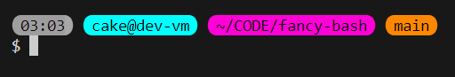
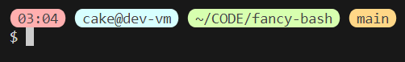

Some bash designs I made for myself. Should work with the default font of every semi-recent terminal, and through SSH of course. I will add more in the future!

# FAQ
- Why are there two metods to install?
    - The **global install** is for ALL users and requires sudo/root. Files are put into `/etc/profile.d/` which applies to everyone.
    - The **user install** is completely contained in your own userprofile. No admin privileges required. Files are added to `~/.bashrc.d/`.

    <br>
- If you want to be super efficient, you can install the `git-prompt` requirement **globally** and have users decide which style they want with a user install. That way they don't have to download the requirement again.
<br>
<br>

# Requirement
### Download git functionality
This is mandatory, else you get errors all the time.\
It's from the official repository for git itself, so no worries. You can [check the file yourself](https://raw.githubusercontent.com/git/git/refs/heads/master/contrib/completion/git-prompt.sh).\

**User install**
```bash
mkdir -p ~/.bashrc.d
curl 'https://raw.githubusercontent.com/git/git/refs/heads/master/contrib/completion/git-prompt.sh' -fo ~/.bashrc.d/git-prompt.sh && . ~/.bashrc.d/git-prompt.sh
```

**Global install**
```bash
sudo curl 'https://raw.githubusercontent.com/git/git/refs/heads/master/contrib/completion/git-prompt.sh' -fo /etc/profile.d/git-prompt.sh && . /etc/profile.d/git-prompt.sh
```
<br>

# Styles
### 🚨 **Neon**


**User install**
```bash
mkdir -p ~/.bashrc.d
curl 'https://raw.githubusercontent.com/rlanger2000/fancy-bash/refs/heads/main/styles/neon.sh' -fo ~/.bashrc.d/rl-fancy-bash.sh && . ~/.bashrc.d/rl-fancy-bash.sh
```

**Global install**
```bash
sudo curl 'https://raw.githubusercontent.com/rlanger2000/fancy-bash/refs/heads/main/styles/neon.sh' -fo /etc/profile.d/rl-fancy-bash.sh && . /etc/profile.d/rl-fancy-bash.sh
```
<br>

### 🖌️ **Pastel 1**


**User install**
```bash
mkdir -p ~/.bashrc.d
curl 'https://raw.githubusercontent.com/rlanger2000/fancy-bash/refs/heads/main/styles/pastel1.sh' -fo ~/.bashrc.d/rl-fancy-bash.sh && . ~/.bashrc.d/rl-fancy-bash.sh
```

**Global install**
```bash
sudo curl 'https://raw.githubusercontent.com/rlanger2000/fancy-bash/refs/heads/main/styles/pastel1.sh' -fo /etc/profile.d/rl-fancy-bash.sh && . /etc/profile.d/rl-fancy-bash.sh
```
<br>
<br>

# Uninstall
**User uninstall**
Uninstalls the components you installed globally.
```bash
rm ~/.bashrc.d/rl-fancy-bash.sh
rm ~/.bashrc.d/git-prompt.sh
```

**Global uninstall**
Uninstalls the components you installed globally.
```bash
sudo rm /etc/profile.d/rl-fancy-bash.sh
sudo rm /etc/profile.d/git-prompt.sh
```